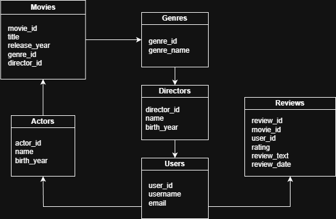

# Movie Recommendation Database Project

## Project Overview
This project is a relational database system for movies, actors, directors, genres, users, and reviews. It demonstrates database design, SQL querying, and data analysis skills. The database can be used to generate insights and simple movie recommendations.

## Database Schema
- **Movies:** Stores movie information
- **Genres:** Movie categories
- **Directors:** Movie directors
- **Actors:** Movie actors
- **Movie_Actors:** Many-to-many relationship between movies and actors
- **Users:** Users who review movies
- **Reviews:** User reviews with ratings and comments

## Setup Instructions
1. Install PostgreSQL or MySQL.
2. Run `tables.sql` to create tables.
3. Run `sample_data.sql` to populate sample data.
4. Run `queries.sql` to test queries.

## Features
- Retrieve top-rated movies
- Find all movies an actor starred in
- Compute average ratings per genre
- Identify users with high ratings
- Fetch movies by release year and director